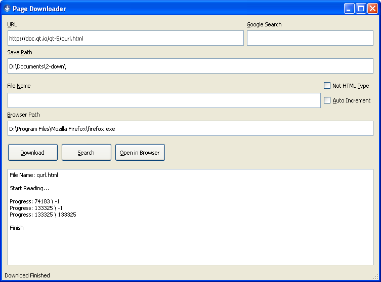

# Page Downloader

Allows to download HTML pages from Internet.
Developed using Qt5.

## Features

- download HTML source page without resources
- search for a term in Google and download the results page as plain HTML
- useful for slow Internet connections which allows to get only the main page content without loading heavy resources (images, styles, scripts)
- incremental filenaming which allows to get a page file without specifying the name

## Shortcuts

- **F1** - Download
- **F2** - Search
- **F3** - Open in Browser
- **Esc** - Exit
- **Enter** - Download/Search if in the URL/Google Search text fields
